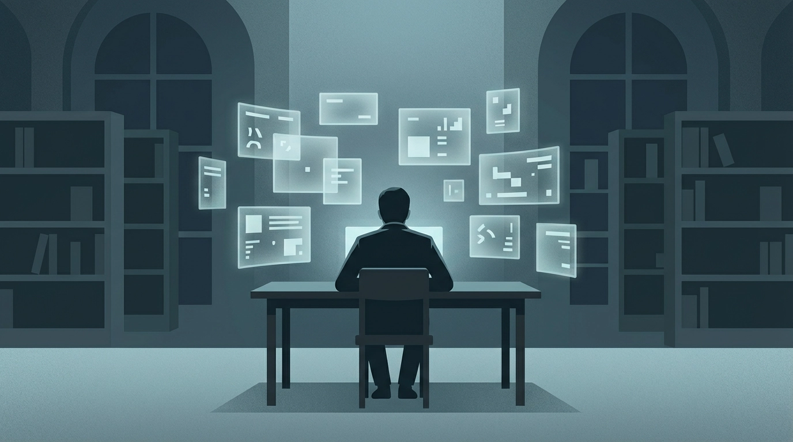

# 景观社会：当我们用「看」替代「活」

## 从图书馆的一个念头说起

周六下午，图书馆。对面坐了一个女生，一直没怎么学习，也没怎么翻书，目光不断四处游移，对我非常干扰。

这并非第一次碰到这样的人。我每三次来，至少有一次会遇到这种不那么像是“来这里学习”的人。于是我忍不住想，她来这里的目的是什么？只是来这里看人的吗？我不由得想起高中时听到过的一个词：

景观社会。

在我当时模糊的理解里，景观社会里的人，似乎总是在看、在打量、在消费别人和场景，却很少真正沉进去做一件事。

然后我意识到，**这个判断本身，才是景观社会最典型的症状。**

---

## 德波说了什么

1967 年，法国人居伊·德波（Guy Debord）写了一本薄薄的书：*La Société du spectacle*，中文译作 **《景观社会》**。核心命题只有一句话：

> 在现代生产条件占统治地位的社会中，整个生活呈现为一种景观的巨大积聚。一切直接经历的东西，都已经转化为一种表征。

- 我们不再直接体验生活，而是观看生活。
- 人与人之间的真实关系，退化成了影像与影像之间的关系。
- 商品逻辑从物质领域蔓延到了符号、影像和体验。资本的积累到达影像阶段，就是景观。

---

## 几个关键概念

### 分离（séparation）

景观的根本机制是**分离**：把生产者与产品、观众与现实、人与人的直接交往不断隔开。

你刷短视频看别人旅行，你点外卖但不知道谁在做饭，你在社交媒体上“社交”却并不真正认识谁，这些都是分离。

### 集中景观 vs. 弥散景观

- **集中景观**：极权体制，单一叙事，一个声音告诉你世界是什么样。
- **弥散景观**：消费社会，琳琅满目的商品选择制造了“自由”的幻觉。你以为你在选择，其实你只是在被选择。

德波晚年（1988）又补了一个概念：**综合景观**。两者融合了，既有宏大叙事的控制，又有消费主义的麻醉。

---

## 景观思维的自我觉察

回到图书馆那个场景。

我看见一个人，几秒内就自动完成了一条推理链：

**不学习 → 到处看 → 浅薄 → 景观社会的产物**

这条链很流畅，但细想全是表象拼接。她在想什么？来图书馆的目的是什么？我一无所知。

我**用观看替代了理解**，用标签替代了认识。这恰恰是德波所批判的思维方式。

**景观社会真正要警惕的，不是“某个人活得景观化”，而是我们自己无意识地用景观逻辑去处理一切。**

判断一个人只需要几秒，理解一个人需要很久。前者是景观，后者是生活。

---

## 所以怎么办

德波自己给出的答案是**情境主义**：不做景观的旁观者，而是主动构建情境，在日常生活中创造真实的、不可被景观收编的体验。

说白了就是：少看，多活。

放下手机去散步，和朋友面对面聊天而不是互相点赞，读一本需要你主动思考的书而不是被算法投喂，这些都是微小的反景观实践。

不必做一个彻底的反叛者，但至少可以在每次下意识地“观看”和“判断”时，停一秒问自己：

**我是在理解，还是只是在看。**
