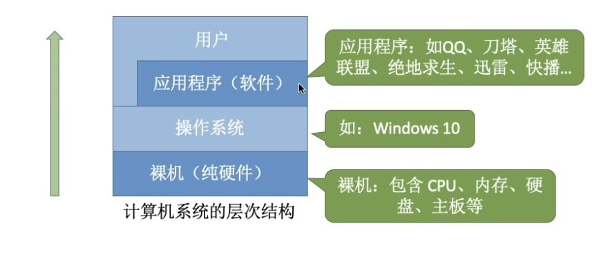
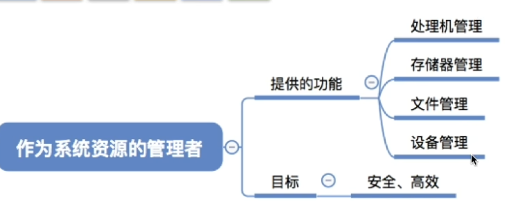

# 操作系统的概念

简单而言，操作系统在用户和硬件之间提供了一个接口，位于硬件之上，用户、应用程序之下。
有趣的是，用户和应用程序和操作系统都有“*相连的部分*”。

- 操作系统管理**硬件+软件资源** eg from任务管理器
- 从而给用户提供软件的方便接口

似乎捕捉到了这门课的主要讲解结构，就是在讲下图右上角的如何管理CPU、内存、文件系统、设备。

---

## 操作系统的功能和目标

一个思想：封装

具体而言：

就是**向上提供方便易用的接口** 

直接给用户用的 

1. GUI 我们手机的软件都是gui形式
2. 联机命令接口（交互式：一条一条输入执行，如 `ls`/`dir`）、脱机命令接口（批处理：一次提交一批命令，如 `.bat`/`.sh`）
3. 程序接口（是通过程序代码间接用的）

其中，1.2给用户用，3给程序（or程序员）用

---

hhh 大概学懂了 很有成就感 
