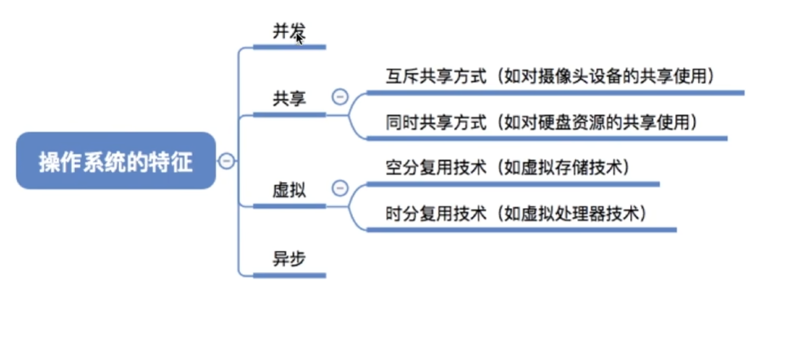

# 操作系统的四大特征

> 📖 对应王道 1.1 节

`并发` `共享` `虚拟` `异步` — 这四个特征是操作系统区别于普通软件的根本标志。

---

## 1. 并发

### 并发 vs 并行

| | 并发（Concurrency） | 并行（Parallelism） |
|---|---|---|
| 含义 | 宏观上同时，微观上交替执行 | 真正的同一时刻同时执行 |
| 硬件要求 | 单核即可 | 需要多核 |
| 类比 | 一个人在做饭和洗衣之间来回切换 | 两个人同时做饭和洗衣 |

### 并发的实现：进程与线程

- **进程（Process）**：一个运行中的程序实例，是 OS 资源分配的基本单位（内存、文件句柄等都按进程分账）。
- **线程（Thread）**：进程内部的执行流，是 CPU 调度的基本单位。
- **关系**：一个进程至少有一个线程，也可以有多个线程。

#### 并发/并行与线程的对应：

- 同一时刻真正占用 CPU 的是线程。
- OS 把就绪线程分配到逻辑核上运行。
- **并行上限 ≈ 逻辑核数**；超过上限的线程排队轮转 → 形成并发。

> 💡 机器有 8 个逻辑核，系统里可以有 200 个进程，但任意时刻最多 ~8 个线程在运行态，其余在就绪态或阻塞态。

---

## 2. 共享

**共享**是指系统中的资源可以被多个并发进程共同使用。

### 两种共享方式

| 方式 | 含义 | 例子 |
|---|---|---|
| **互斥共享** | 同一时间只允许一个进程访问资源 | 打印机 — 不能两个文件同时打 |
| **同时共享** | 允许多个进程在同一时间段内访问资源 | 磁盘 — 多个进程可以同时读不同文件 |

### 并发和共享的关系

**相辅相成**：
- 没有并发 → 不需要共享（资源独占就行）
- 没有共享 → 并发无法实现（进程需要共用资源）

---

## 3. 虚拟

**核心思想**：把一个物理上的实体变为多个逻辑上的对应物。

### 两种虚拟技术

| 技术 | 原理 | 例子 |
|---|---|---|
| **时分复用** | 把时间分成小段，轮流使用同一个物理资源 | 单核 CPU 并发执行多个程序 |
| **空分复用** | 把空间分成小块，按需调入调出 | 4G 内存跑 5G 的程序（虚拟内存） |

**时分复用**：一个 CPU 只有一个核，要同时开四个程序 → OS 在微小时间段内交替执行，让每个程序"以为"自己独占了 CPU。

**空分复用**：内存只有 4G，要跑 5G 的程序 → 虚拟内存技术把程序分为多个块，运行时只把当前需要的块调入内存，暂时不用的块留在磁盘上。当需要的块不在内存中时换入，同时可以把不用的块换出。用户感觉自己拥有了远大于 4G 的"虚拟"内存空间。

---

## 4. 异步

**异步**：在多道程序环境下，并发执行的程序不是一贯到底的，而是走走停停、以不可预知的速度向前推进。

### 关键理解："排到时间 ≠ 能执行"

- **时间排开** → 解决的是"谁先上 CPU"（调度问题）
- **阻塞** → 取决于"执行条件是否满足"（资源问题）

> 💡 举例：进程 A 在 9~10 点使用资源"心"，进程 B 排在 10~11 点。
> - 如果 A 在 10 点前释放了"心" → B 拿到资源，正常执行
> - 如果 A 没释放 → B 即使轮到时间片，也得**阻塞等待**
>
> **一句话：`排到执行时间` ≠ `执行条件满足`**

---

## 小结

四大特征的关系：

```
并发 ←相辅相成→ 共享
 ↓                ↓
虚拟（以并发为前提）  异步（由并发产生）
```

> 其中**并发**是最基本最重要的特征。没有并发，其他三个就无从谈起。


